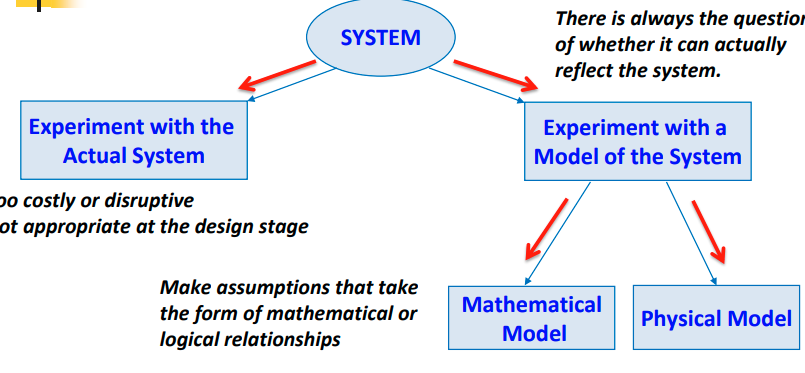
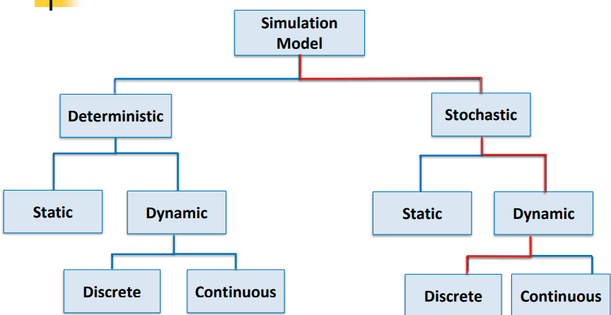
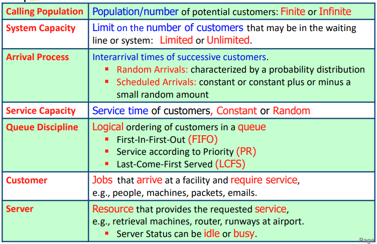
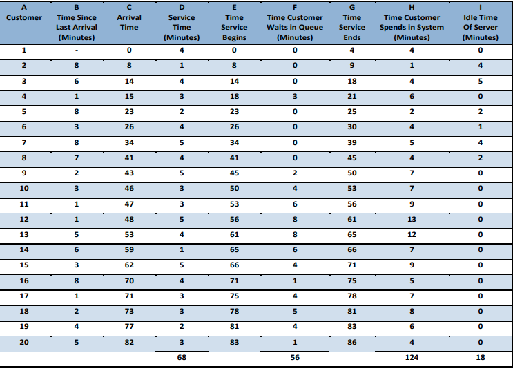

# Introduction to Computer Modelling and Simulation

## Part 1: Computer Simulation
- Focusing on discrete-event systems and model design:
    - Step 1: Generation of Input data using random number generation.
    - Step 2: Development of system simulation based on our knowledge
of the system and inputs while considering the order of the
occurrence of the events in the system.
    - Step 3: Output statistical analysis and model validation.

## Nature of Simulation
- Simulation
    - Imitation of the operations of a real-world process or system over
time
    - Generation of an artificial history of a system
    - Observation of the artificial history to deal with the operating
    characteristics of the real system

- Morden simulation is a computer program that mimics the
behaviour of a real-world “system” over time, including its inputs
and outputs.
- To study the system, assumptions/approximations about how it works
are often made, both logical and mathematical, make simulation feasible
and efficient.
- real world models are often to cmoplex therefore need to make asumptions

Simulation can be used as
- Design tool for predicting and optimizing the performance of new systems
▪ Analysis tool for predicting the effect of changes to the existing systems

## systems
- A group of objects or components that interact together towards the accomplishment of some logical goals
- Systems are affected by the changes occurring outside the system (environment).
- Entity: Any object or component in the system which requires explicit representation, e.g., a server, a customer, a machine
    ▪ Attributes are the properties of entity.
    ▪ Attributes are represented by state variables.

- Activity: Set of actions,
- State of a System
Collection of variables and their values necessary to describe the system at a particular time

## Systems: Discrete vs. Continuous
- discrete: state variable change instantaneously at seperted points in time. 
- state changes at specific points in time, i.e, occur only whencustomer arrives/departs

- continous: state variable changes continoisly as finction of time, ie. veloctiy

## Models
- is a simplified representation of an object, a system, or an idea in some form other than that of the entity itself
    - modelling is th eprocess of representnint a system with specific tool to study its behavious

Model is used as a design tool and also an analysis tool
- To study systems in the design stage before such systems are built.
- To study potential changes to the systems and predict their impact after they are built and in operation.
- to get answers for "what if" questions

        

### two ways to solve the model:
- Physical models are the models whose physical characteristics resemble those of the actual system. It looks or feels like the real thing.
- Mathematical model uses symbolic notation and mathematical equations to
represent a system.
    - 1. Analytical Solution: If the model is
    simple enough, mathematical
    approach is feasible , e.g., calculus,
    algebra, probability theory.
    - Use analytical model whenever possible due to its efficiency and low-cost.

    - 2. Simulation Solution: Numerical computerbased programs are developed to imitate the operation of the system over time.
    - use simulation when: 
        - Modelling complex dynamic systems theoretically needs too many
simplifications and thus the resulting analytical models may not be
valid. Simulation does not require that many simplifying assumptions
        - Complete mathematical formulation does not exist or an analytical solution cannot be developed
        - Analytical methods are available, but the mathematical procedures are so complex that simulation provides a simpler solution;

#### However, the problems with simulation are:
- Simulations are often complex error-prone pieces of software.
-  Simulation can take a LONG time to execute.
- Simulation only produces approximate answers.
- Analytical models are less flexible, but they are exact and efficient.

It is not appropriate when:
- If data is not adequate or available for study.
- If system behavior is too complex.#
- If verification and validation are not practical due to
limited resources
- If users have unreasonable expectations.

### Advantages of Simulation
- Study new designs without the need of extra resources
- Study new designs without interrupting real systems
- Improve understanding of the system and interaction of components
- Determine important interaction of variables and the importance of
variables on the system performance
- Verify analytic solutions and results
- Time can be compressed or expanded allowing for speedup or lowdown of the phenomena under consideration
- It is an effective tool for training and education (flight simulators to
train pilots)
- Less dangerous and less expensive

### Taxonomy of Simulation Models
        

- Most operational models are stochastic, dynamic, and discrete,
therefore will be called discrete-event simulation models

#### Simulation Models: Stochastic vs. Deterministic

| determinisitc | stochastic
| ----- |----- |
| no pobablisitic component/random var in sys| has 1+ rnadom var as input|
|Have a known set of fixed inputs | Random inputs lead to
random outputs. Random outputs are estimates of true model characterstics |

#### Simulation Models: Static vs. Dynamic
| Static | Dynamic|
| ----- |----- |
| Time plays no role|Represents a system as it evolves over time|
|Example: Monte Carlo Method, calculating value of Pi|Exemple: Simulation of a Bank from 9:00 A.M. to 4:00 P.M. |

#### Simulation Models: Discrete vs. Continuous
| Static | Dynamic|
| ----- |----- |
| TThe state variable(s) changes only at discrete points in time |The state variable(s) changes continuously |

## Steps in a Simulation Study
1. Problem formulation
    - Understand the problem to be addressed by simulation clearly.
    - Agree the problem formulation between the policy maker and the
    analyst.

2. Setting of the objectives and overall project plan
    - The objectives indicate the questions to be answered by simulation.
    - What to do with the simulation?
    -  Determine whether simulation is the appropriate methodology
    -  Form the project plan

3. Model conceptualization (constructing the model)
    - Model: an abstract representation of the system.
    - What should be included in model? What can be left out?
    - Appropriate choice depends on the purpose of the model.
    -  What abstractions should be used? What is the level of details?

4. Data collection
    - The more data you have→ the more complete information you get→ the
    more precise model you can build→ the better solution you would get

5. Model translation (Developing a computer program)
    - Program the model into a computer language from a computational model,
    -  OR: Use special-purpose simulation software.

6. Verified?
    - Is the computer program prepared for the simulation model correct?
    - Are the input parameters and logical structure of the model correctly
    represented in the computer?
    - Is the computer program performing properly? 

7. Validated?
    - Determine if the model is an accurate representation of the real system.
    -  Validation is an iterative process of comparing the model to actual system
    -Helps to improve the model.

8. Experimental design: Decide on
    - The length of the initialization period,
    - The length of simulation runs, and
    - The number of replications to be made of each run.

9. Production runs and analysis
    -  Estimate the performance measures of the system design that is being
    simulated.

10. More runs?
    - The analyst determines of additional runs are needed.

11. Documentation and reporting
    - Program documentation
    - Reusability
    - Maintenance
    - Modification of parameters

12. Implementation: The success of the implementation phase depends on
how well the previous eleven steps have been performed

### Alternative Approaches to Modeling and Simulations
- Discrete-event simulation follows a logic in simulation which is
sequential, and all work is done on a single computer.
    - Parallel and distributed simulation
    - Various kinds of parallel and distributed architectures
    - Break up a simulation model in some way
    - Run the different parts simultaneously on different parallel processors
- Web-based simulation
    - Client-server simulation
    - Central simulation engine, submit “jobs” over the web
    - Wide-scope parallel/distributed simulation
 
 ## Simulation Table
 - provides a systematic method for tracking system state over time.
 - Steps to consider:
    1. Determine the characteristics of each of the inputs to the
    simulation.
    2. Construct a simulation table (repetitions, inputs, response).
    3. For each repetition, generate a value for each of the inputs.

### Simulation of Queuing Systems
- Simulation is often used in the analysis of queuing models
- Typical measures of system performance
    ▪ Server utilization
    ▪ Length of waiting lines
    ▪ Delays of customers

- Key Elements of Queuing Systems
        

- In simulation, events usually occur at random times.
- Randomness imitates uncertainty in real life.
- Random numbers are distributed uniformly and
independently on the interval (0,1).
- Interarrival times and service times are generated
from the distributions of random variables that
characterize the nature of arrivals and departures,
respectively.

### properties of single-server queueing system
| **Feature**           | **Description**                                                                 |
|-----------------------|---------------------------------------------------------------------------------|
| **Calling Population** | Infinite                                                                        |
| **Nature of Arrival Process** | Random Fashion                                                          |
| **Service Time**       | Random Length according to a probability distribution                            |
| **System Capacity**    | No Limit                                                                        |
| **Queuing Discipline** | FIFO (First In, First Out)                                                      |
| **State Variables**    | • Status of server (idle, busy) • Current length of the queue • Time of arrival of each customer now in queue |
| **Events**            | • Arrival of a new customer • Service completion (and departure) of a customer • End-simulation event (a “fake” event) (Maybe) |

#### Example: Queueing Model of a Grocery Store
-  Arrival pattern is characterized by InterArrival Times (IAT), which are random numbers between 1 and 8 minutes apart
- Time required by the cashier to serve a customer is characterized by the Service Time (ST) distribution. Service times vary  from 1 to 6 minutes randomly.
- The first customer arrives at time 0 and the successive customers arrive after each interarrival time

(customer 3 arrives at 14, which is previous customer time + interval time)
        