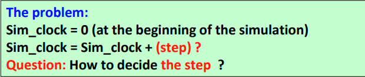
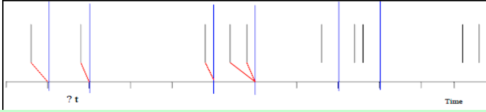
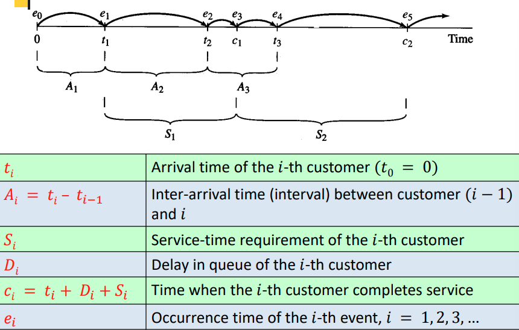
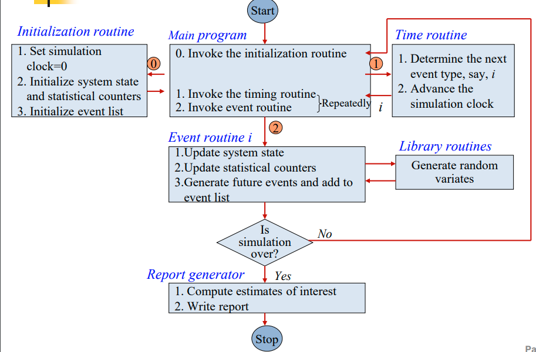
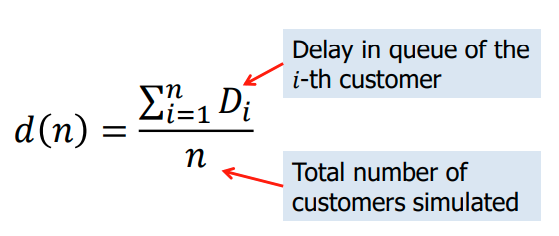
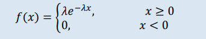
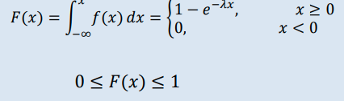
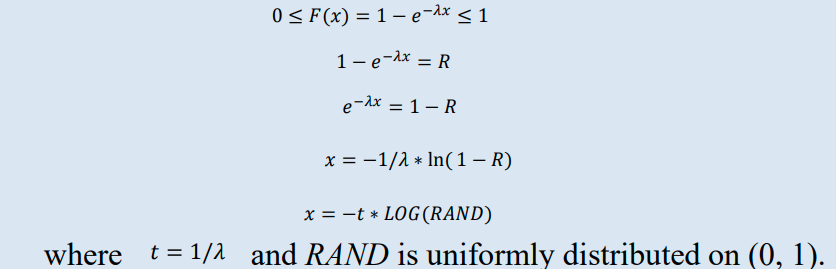
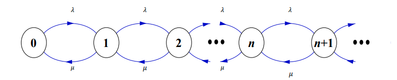

# Discrete-Event Simulation
- Modeling of a system as it evolves over time and the system state changes instantaneously at a discrete set of points in time

- The basic idea:
    - Only events can change the system state when they occur at a countable number of points in time.
    - No need to track the system state between consecutive events.

- Event: An instantaneous occurrence that may change the state
    of the system.
        - e.g., arrival or departure of a customer to or from the queue.

- Event list: A list of consecutive event notices ordered by the time of occurrence (aka  future event list FEL). 
    - at minimum. the record of FEL includes the type (ie arrival/depature) and the occurence time ffor each event

## Time-Advance Mechanism
- Simulation clock: A variable representing the simulation time (i.e., the current value of simulated time in the model)
- The time unit must be consistent for each individual simulation

- When a simulation model is generated, the time unit is usually the same as that of the input parameters.
    
    - approaches for time advance
        1. Fixed-increment time advance (seldom used)
        2. Next-event time advance (usually used)

### Fixed-increment time advance Approach

- step, t, is fixed regardless of the actual time of event
- If one or more events occurred during a step, these events are considered to occur at the end of this step

  
    - we can see the x axis represents time, which is evenly split
    - here we see thta if we check state in incements of 1 min for example, and cutsomer is 30 secons in, we miss that interval, therefore we shift to next valid interval. but also note if 1+ customer in a gap between intervall, all will be shifted to next interval, meaning we loose information about the order in which they arrived

- adv:  Very simple! Can be very efficient when used in right case. (ie ATM (Asynchronous transfer model) networks (Cell size is fixed to 53 Bytes))

- disadv: How big should t be?
    - f 𝒕 is too big (compared to the frequency of event occurrence), => -- Large approximation error -- Conflict in event occurrence (many events are shifted to occur simultaneously )

    - If t is too small: Too many empty cycles => long computational time and low efficiency

### Next-Event Time-Advance Approach

- here we can observe jumps in the time axis to next event, meaning we miss no events. this way the system updates at exactly the correct times

- Initialize simulation clock to zero.
- Determine the occurrence time of future events- event list
- Clock “jumps” from one event time to the next
- Clock advances to the next (most imminent) event
    - The system state is updated.
    - The type and time of future events are determined to update the event list.
- Continue until some pre-specified stopping rule of simulation is satisfied.
    
    - Next-Event Time Advance in Single-Server Queueing Systems

### Flow Control for Next-Event Time-Advance
Approach
    
    - statistical counters can represent delay, utilisaiton ...
    - the time routine decides what the next event is (type), this can be done by checking event list to find what happens first, and advance simultaion clock to the time of arrival of first customer (ith customer)
    - event routine conducts what should be changed to the sys, ie sys state and statistical counters + generate future events and add to the event list to esnure the the simulation can keep running + continue doing so till termination criteria at whic ponit we gen the reprort

## Components of a Discrete-Event Simulation Model
- System state: The collection of state variables necessary to
 describe the system at a particular time.
- Simulation clock: A variable giving the current value of simulated time.
- Event list:  A list containing the next time when each event will
 occur as well as the event type (arrive/dpature).
- Statistical counters:  Variables used for storing statistical information.
- Initialization routine: A subprogram to initialize the simulation at time 0.
- Timing routine:  A subprogram to determine the time and type of the
 next event and advance the simulation clock.
- Event routines:  To carry out the logic for each event (what to happen)
- Library routines: To generate random variates
- Report generator: To summarize and report results at end
- Main program : To tie routines together and execute them in right order

*yopu can create an event list before hand but if you need to early stop you waste resources, as you jasve not used majority of events. also storage considerations. THreerfore if we generate the next event after completing the current, we always have the next event in terms of storage and computation consumption*

## Approaches to Event-Scheduling

- Event-scheduling: using the next-event time-advance mechanism
with focus on the events and how they affect the system state.
    - Is based on the Future Event List (FEL).
    - FEL contains all scheduled future events and their associated
    occurrence time.
    - At any given time 𝑡, FEL records the event type and the event time.
    - FEL is ordered by the event time; events are arranged
    chronologically, 𝑡 < 𝑡1 < 𝑡2 < 𝑡3 < … < 𝑡1

### perfomance measures
- Expected average delay in queue of the n customers completing service
    
    - sum of delays of all customers / sum(num of customers)
    - therefore need to record delay for each customer

### intuitive explaination

based on interarrival times we can determine the acrtual arrival times, ie first arrivat a1 = 0.4 then a2 = 1.2 therefore customer 2 arrives at ( 1.6)

t0 = total time no customers is waiting in queue
t1 = how long 1 customer is waiting in queue
t2 = how long 2 customers waitingin in the cusue
therefore 0 * t0 + 1 * t1 * 2 + t2
then divide by total simulation time
which will give total waiting time in queue

##### Measures of Performance: Expected Utilization of the Server
vertcal axis represents the busyness of server
and x axis is time
so just sum the total time the server is busy over total time to get the percentage of the serceer being bugy

b(t) how busy the eserver, q(t)  waiting time

# Implementation of A Single-Server Queueing System Simulator

## Kendall’s Notation for Describing Queueing Systems
- Queueing Theory - a discipline within the mathematical theory of probability.
- Kendall's notation is the standard system used to describe and classify queueing models in 1953.

- Let us denote a queueing system by A/S/c/K/N/D, where
    – A: probability distribution of inter-arrival times
    – S: probability distribution of service times (job sizes)
    – c: number of servers
    – K: capacity of the queue - the maximum number of customers
    in the queue
    – N: size of the population from which the customers come
    – D: queuing discipline (i.e, FIFO, LIFO, Priority)

### M/M/1 Queueing System
- Exponentially distributed random variables are notated by M, meaning Markovain or memoryless.
    - exponential distribution has memoryless (markovian property). this property means that they arrive/occur independent of eachother. so here we are saying arrival time and service time are independent for each event 
    - present events that happen randomly but with a constant probability over time.
    - memoryless: means that the past doesn't affect the future

- If the queue capacity and population size are infinite, the service
discipline is FIFO, then the symbols, K, N, and D, are omitted.
    - means that we assume there's no limit to how many people can wait in the queue (infinite capacity) and how many people can arrive (infinite population).

- Hence, M/M/1 Queueing System is a single-server queueing
system with exponential inter-arrival times (Poisson input with
mean arrival rate λ), exponential service times (with mean service
rate μ), one server, and infinite queue capacity.
    -  M1 (first m) refers to Markovian (or exponential) arrival times (customers arrive randomly, following a Poisson distribution, with a mean arrival rate λ).

The second M stands for Markovian (or exponential) service times (the time to serve a customer is also random, with a mean service rate μ).
The 1 indicates there's only one server (one person or machine serving the customers).

## Design of an M/M/1 Simulator

- State variables:
    1. Status of server (idle, busy) – needed to decide what to do with an arrival,
    2. Current length of the queue – to know where to store an arrival that must wait in line,
    3. Time of arrival of each customer now in queue – needed to compute the time in queue when service starts.

- Events:
    1. Arrival of a new customer
    2. Service completion (and departure) of a
    customer
    3. End-simulation event

#### Step 1: Define variables

▪ System State Variables
    server_status: {idle = 0, busy = 1}
    num_in_q: {0, 1, 2, ……, Q_LIMIT}
    time_arrival [Q_LIMIT + 1]

▪ Events
    arrive (Poisson process with mean interarrival time)
    depart (Exponentially distributed with mean service time)
    end-simulation: num_customer_required, num_customer

▪ Global variables
    sim_time, time_last_event
    next_event_type: {arrive = 1, depart = 2}
    time_next_event[1], time_next_event[2]
    total_of_delays
    area_num_in_q, area_server_status

#### Step 2: Define MAIN() function

main()
{
    initialize(); // Initialize the simulation

    while (num_customer <
        num_customer_required)
    {
    timing(); // Determine the next event

    update_time_avg_stats();

    if (next_event_type == 1)
        arrive(); // next event is arrival
    else
        depart(); // next event is departure
    }
    report();
}

#### Step 3: Define INITIALIZE() function

initialize()
{ 
    mean_interarrival = ???;
    mean_service = ???;
    num_customer_required = ???; // used to end simulation
    sim_time = 0.0;

    // initialize the state variables
    num_customer = 0;
    num_in_q = 0;
    server_status = 0; // server status is IDLE

    // initialize the statistical counters
    area_num_in_q = 0.0;
    area_server_status =0.0;
    time_last_event = 0.0;

    // Initialize event list
    time_next_event[1] = sim_time + expon(mean_interarrival);//determine next arrival
    time_next_event[2] = max_double; //determine next departure
}

#### Define TIMING() function

timing()
{
    // Determine the event type of the next event to occur
    if ( time_next_event[1] <= time_next_event[2] )
        next_event_type = 1;
    else
        next_event_type = 2;

    time_last_event = sim_time;
    // advance the simulation clock
    sim_time = time_next_event[next_event_type];
}

#### Step 5: Define ARRIVE() function

arrive()
{ // Schedule next arrival
    time_next_event[1] = sim_time +  expon(mean_interarrival);
    if (server_status == 0) // server is IDLE
    { 
        server_status = 1;
        time_next_event[2] = sim_time +
        expon(mean_service);
        num_customer ++;
    }
    else // server is BUSY
    {
         num_in_q ++;
        time_arrival [num_in_q] =
        sim_time;
    }
}

#### Define DEPART() function

depart(){
    if (num_in_q == 0) // queue empty
    { 
        server_status = IDLE;
        time_next_event[2] = max_double;
    }
    else
    { 
        num_in_q --;
        total_of_delays += (sim_timetime_arrival[1]);
        num_custs_delayed ++;
        time_next_event[2] = sim_time
        +expon(mean_service);

        for ( i=1; i<=num_in_q; i++ )
            time_arrival[i]=time_arrival[i+1];
    }
}

#### Step 7: Define UPDATE_TIME_AVG_STATS() function
update_time_avg_stats()
// Update area accumulators for time-average statistics
{
    time_past = sim_time-time_last_event;
    area_num_in_q += time_past*num_in_q;
    area_server_status += time_past*server_status;
}

#### Step 8: Define REPORT() function
report()
// Compute the desired measures of performance
{
    average_delay = total_of_delays / num_customers;
    average_number_in_queue = area_num_in_q / sim_time;
    server_utilization = area_server_status / sim_time;
}

##### cont (note)
- Inter-arrival intervals are exponentially distributed.
- The probability density function (PDF) of an exponential distribution
is given by
    

- and its cumulative distribution function (CDF) given by:
    

#### Step 9: Define EXPON(mean) function
float expon(mean)
// Return an exponential random variate with mean "mean".
{
    return (-mean*log(RAND)); // RAND is uniformally distributed on (0, 1)
}

- We can generate random numbers according to the exponential distribution by using the inverse transform technique
    

- To generate a uniformly distributed random number on (0, 1) in Java use math.random()

#### Step 10: Validation of the simulation
 - server_utilization ( 𝜌 ) = 𝜆/𝜇 = mean service time / mean interarrival time ;
 - average_delay ( 𝑤 ) = 𝜆/𝑢(𝑢 − 𝜆) ;
 average_number_in_queue ( 𝐿 ) = 𝜆^2/𝑢(𝑢 − 𝜆) ;

 ## M/M/1 Queue: Markov Chain Formulation
-  N(t): The number of customers in the system at time t.
 The system is at State n if N(t) = n.
- Exponentially distributed “M” --> memoryless property --> N(t) is a
continuous-time Markov chain (CTMC) with state space 0, 1, · · · .
- The state-transition diagram for this Markov chain is as below:
    
    -  Traffic ratio or traffic intensity: 𝜌 = 𝜆/𝜇 
    - Stationary probability of State n: πn

pdf = read it as after time x, the probability of a customer arriving in the system is on the y, moideled by the curve using lambda, where lambda is the arrival rate

- because we dont know what time the next customer would arrive (on the axis), -> can we use a number between 0,1 to find the next arrivarl time by generating a random naumber in that range, thn looking at the curve and extrapoliating to the x

lambsda is arrival rate in markov chain, mu is service rate. o to go from state 1, 0 it emplies 1 customer has depearted with service rate mu

*interarrive times generated with random numbres*